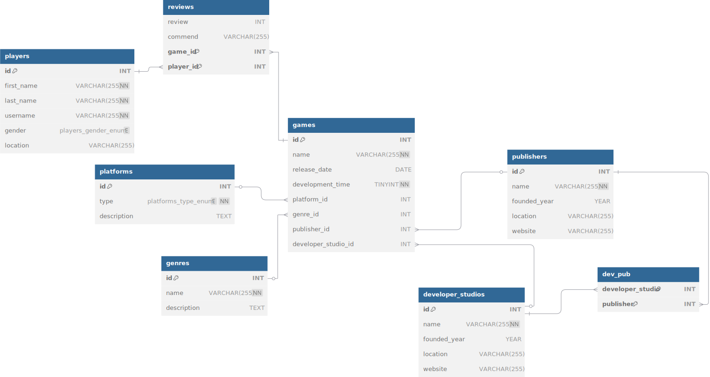

# Design Document

By Filip Matura

Video overview: <URL HERE>

## Scope

Database of information related to video games

* Purpose of this database was to create platform of information related to video games, where players can put their review and comment, when they finish the game
* In the scope of database are include games, platforms, players, developer studios, publishers, genres and reviews

## Functional Requirements

* What should a user be able to do with your database?
  * Add, delete, update their reviews
  * Correct informations related to games, publishers, developers.
  * Check most rated video games or publisher with the most positive/negative reviews
  * Check game platform availability 
* What's beyond the scope of what a user should be able to do with your database?
  * Delete games, publishers, developers, platforms, genres

## Representation

### Entities

The database entities:

1. ____Games:____
   
   - ____Attributes:____ ID (INT), name (VARCHAR), release_date (DATE), platform_id (INT), genre_id (INT), publisher_id (INT), developer_studio (INT)
   
   - ____Constraints:____ Primary key on ID, foreign key referencing platforms table on platform ID, foreign key referencing genres on genre ID, foreign key referencing publishers on publisher ID, foreign key referencing developer_studios on developer ID

2. ____Genres:____
   
   - ____Attributes:____ ID (INT), name (VARCHAR), description (TEXT)
   
   - ____Constraints:____ Primary key on ID

3. __Platforms:__
   
   - ____Attributes:____ ID (INT), type (ENUM), description (TEXT)
   
   - ____Constraints:____ Primary key on ID

4. ____Players:____
   
   - ____Attributes:____ ID (INT), first_name (VARCHAR), last_name (VARCHAR), username (VARCHAR), gender (ENUM), location (VARCHAR)
   
   - ____Constraints:____ Primary key on ID

5. ____Reviews:____
   
   - ____Attributes:____ review (INT), comment (VARCHAR), game_id (INT),  player_id (INT)
   
   - ____Constraints:____ Primary key on game_id and player_id, foreign key referencing games on game ID, foreign key referencing players on player ID

6. ____Developer studios:____
   
   - ____Attributes:____ ID (INT), name (VARCHAR), founded_year (YEAR), location (VARCHAR), website (VARCHAR)
   
   - ____Constraints:____ Primary key on ID

7. ____Publishers:____
   
   - ____Attributes:____ ID (INT), name (VARCHAR), founded_year (YEAR), location (VARCHAR), website (VARCHAR)
   
   - Constraints: Primary key on ID

8. ____Developers - Publishers connection:____
   
   - ____Attributes:____ developer_studio (INT), publisher (INT)
   
   - ____Constraints:____ Primary key on developer_studio and publisher, foreign key referencing developer_studios on developer ID, foreign key referencing publishers on publisher ID

### Relationships

In this section you should include your entity relationship diagram and describe the relationships between the entities in your database.

## Optimizations

The following optimizations have been implemented:

* Which optimizations (e.g., indexes, views) did you create? Why?

The following views have been implemented:

## Limitations

* What might your database not be able to represent very well?
  * Average player time not supported
  * Some game information not supported (engine, age restriction etc.)
